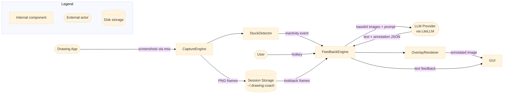

# Drawing Coach

An AI-powered desktop app that watches your digital drawing session and gives real-time coaching feedback via a vision LLM. It captures your canvas periodically, detects when you are stuck, and returns targeted suggestions — as text or as correction lines drawn directly onto your screenshot.

---

## Architecture



The app runs as a **GUI desktop window** — PyQt6 with a live feedback panel, session history thumbnails, and a system tray icon.

---

## Features

- Captures screenshots of any drawing application at a configurable interval (default: 30 s)
- Detects when you are stuck via pixel-change (MAE) analysis, or responds to a manual hotkey
- Four feedback modes: Quick Hint, Full Critique, Practice Exercise, and Overlay (correction lines and annotations drawn directly onto the canvas screenshot)
- Drawing style and focus selector — choose from presets (Line Drawing, Realistic, Anime/Manga, Chibi, Concept Art, Portrait) or enter free text (e.g. `gothic pokemon`) to tailor every LLM prompt
- Works with any vision-capable LLM via [LiteLLM][litellm] — OpenAI, Anthropic, Ollama, and more
- Session history persisted to disk with duplicate-frame dropping and configurable session retention
- Surfaces LLM errors explicitly: rate limits, content-policy flags, credit exhaustion

---

## Prerequisites

| Tool | Version | Notes |
|------|---------|-------|
| Python | `>=3.13` | |
| uv | latest stable | [Install uv][uv-install] |
| xdotool | any | Linux only — `apt install xdotool` |
| pyobjc | `>=9.0` | macOS only — installed via `.[macos]` extra |
| pywin32 | `>=306` | Windows only — installed via `.[windows]` extra |

> A vision-capable LLM API key is required (e.g. OpenAI `gpt-4o`, Anthropic `claude-3-5-sonnet-20241022`, or a local [Ollama][ollama] model such as `ollama/llava`). API keys are stored in the system keyring — never in plain text on disk.

---

## Installation

### Pre-built binaries (recommended)

Download the latest release for your platform from the [GitHub Releases][releases] page:

| Platform | File | Approx. size |
|----------|------|-------------|
| Windows | `drawing-coach-<version>-windows.zip` | ~70 MB |
| macOS | `drawing-coach-<version>-macos.zip` | ~90 MB |
| Linux | `drawing-coach-<version>-linux.zip` | ~65 MB |

Unzip and run the `drawing-coach` executable inside.

> **macOS**: On first launch, right-click → Open to bypass Gatekeeper. Then grant **Screen Recording** permission in **System Settings → Privacy & Security → Screen Recording**, and **Accessibility** permission if the global hotkey is needed.

> **Linux**: Install `xdotool` (`apt install xdotool`) for window detection.

### Install from source

```bash
git clone <repo>
cd drawing-coach

# GUI desktop app
uv sync --extra gui

# macOS — also install pyobjc bindings
uv sync --extra gui --extra macos

# Windows — also install pywin32
uv sync --extra gui --extra windows
```

---

## Configuration

The application stores its configuration in `~/.drawing-coach/config.json`. The API key is stored separately in the system keyring.

The following environment variables override the file config at startup. Only `DRAWING_COACH_MODEL` and `DRAWING_COACH_API_KEY` need to be set consciously; the rest have working defaults.

| Variable | Required | Default | Description |
|----------|----------|---------|-------------|
| `DRAWING_COACH_MODEL` | Yes | — | LiteLLM model identifier (e.g. `gpt-4o`, `claude-3-5-sonnet-20241022`, `ollama/llava`) |
| `DRAWING_COACH_API_KEY` | Yes | — | API key for the chosen provider |
| `DRAWING_COACH_API_BASE` | No | *(blank)* | Override API base URL (Ollama: `http://localhost:11434`, LiteLLM proxy, etc.) |

> `DRAWING_COACH_MODEL` and `DRAWING_COACH_API_BASE` override `~/.drawing-coach/config.json` at startup. API keys are always read from the system keyring.

In the GUI, all settings (capture interval, stuck-detection thresholds, look-back frames, session retention, style focus) are accessible via **Settings**.

---

## Running Locally

```bash
uv run drawing-coach
# or equivalently:
uv run python -m drawing_coach
```

On first launch, the onboarding dialog guides you through:
1. Configuring your LLM (model name and API key)
2. Selecting your drawing application window
3. Starting automatic capture

## LLM Configuration Examples

| Provider | Model string | API key | Base URL |
|----------|-------------|---------|----------|
| OpenAI | `gpt-4o` | `sk-...` | *(leave blank)* |
| Anthropic | `claude-3-5-sonnet-20241022` | `sk-ant-...` | *(leave blank)* |
| Ollama (local) | `ollama/llava` | *(leave blank)* | `http://localhost:11434` |
| LiteLLM proxy | `openai/gpt-4o` | your proxy key | `http://localhost:4000` |

---

## Hotkey

Default: **Ctrl+Shift+F** — press at any time to request immediate feedback.

Configurable in **Settings → Capture** tab.

---

## Testing

Dev dependencies (pytest, pytest-qt, black, ruff, pyright) are declared in the `dev` dependency group and installed automatically by `uv sync`.

```bash
# Run all tests
uv run pytest

# Run with verbose output
uv run pytest -v

# Check formatting
uv run black --check src/ tests/

# Lint
uv run ruff check src/ tests/

# Type-check
uv run pyright src/
```

The test suite covers the capture engine (ring buffer, dedup), stuck detector, feedback engine (LiteLLM mocked), LLM config persistence, overlay renderer, drawing style injection, and version embedding.

---

---

<!-- References -->
[releases]: ../../releases/latest
[litellm]: https://docs.litellm.ai/
[ollama]: https://ollama.com/
[uv-install]: https://docs.astral.sh/uv/getting-started/installation/
