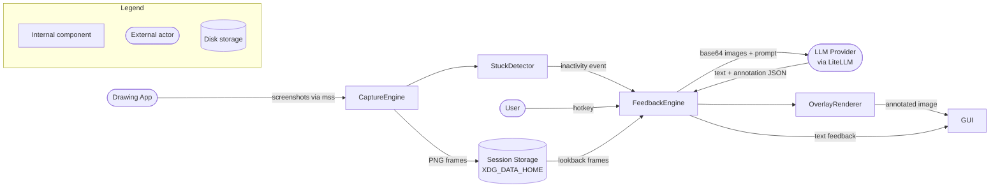

# Drawing Coach

An AI-powered desktop app that watches your digital drawing session and gives real-time coaching feedback via a vision LLM. It captures your canvas periodically, detects when you are stuck, and returns targeted suggestions — as text or as correction lines drawn directly onto your screenshot.

---

## Architecture



The app runs as a **GUI desktop window** — PyQt6 with a live feedback panel, session history thumbnails, and a system tray icon.

### Platform-specific window capture

Each platform's `WindowBackend` (`window_manager.py`) implements `capture_image(window_id)` to grab the selected window's content:

- **Windows/Linux**: `mss.grab()` with the window's rect (`get_window_rect`).
- **macOS**: a direct CoreGraphics call, `CGWindowListCreateImage(CGRectNull, kCGWindowListOptionIncludingWindow, windowID, imageOption)`, scoped to the window's own ID rather than a screen rectangle. `mss`'s macOS backend captures a screen *region* (compositing whatever is on-screen there), which bleeds in other windows when they overlap the target — passing `windowID` directly instead avoids that entirely.

---

## Features

- Captures screenshots of any drawing application at a configurable interval (default: 30 s)
- Pause/Resume control for capture; disabled until a drawing window has been selected via **Select Window**, since capture has nothing to monitor before that
- Detects when you are stuck via pixel-change (MAE) analysis, or responds to a manual hotkey
- Four feedback modes — Quick Hint, Full Critique, Practice Exercise, and Overlay (correction lines and annotations drawn directly onto the canvas screenshot) — selected via a horizontal radio-button strip in the feedback panel, with a **Request Feedback** button right beside it to fire a request in the currently selected mode. Overlay mode always analyses a single frame — the most recent capture — regardless of the configured look-back setting, so the LLM's annotation coordinates are never ambiguous about which image they describe; annotation labels are always drawn on a fixed, high-contrast background so they stay legible no matter what's underneath them.
- **Feedback Management** panel: opening it (toolbar button, tray menu) just shows the panel — no LLM request is sent until you click **Request Feedback** inside it (the hotkey and automatic stuck-detection still request feedback directly, as before). The overlay image (top) and feedback text (bottom) are shown together in a resizable split with a draggable divider; feedback text always scrolls to show the full response, and the overlay image can be zoomed in/out (`+`/`−`/**Reset** buttons, or `Ctrl+Wheel`) and panned to see annotation detail
- Drawing style and focus selector — choose from presets (Line Drawing, Realistic, Anime/Manga, Chibi, Concept Art, Portrait) or enter free text (e.g. `gothic pokemon`) to tailor every LLM prompt
- Works with any vision-capable LLM via [LiteLLM][litellm] — OpenAI, Anthropic, Ollama, and more
- Feedback requests prefer structured JSON output (one schema-validated response carrying the visible feedback, memory observations, and overlay annotations together) and only try it once per app launch — if the configured provider doesn't support it, the app falls back to prose parsing for the rest of the session, with a one-time warning that memory notes and overlay annotations will be less reliable until restart
- Session history persisted to disk with duplicate-frame dropping and configurable session retention; double-click any thumbnail in the history panel to open it in the system default image viewer, or hover over one — which highlights the row's background — to reveal a themed delete button that removes it from the buffer (without deleting the file) so it's excluded from the next LLM request — a blue border highlights the frames the next request will actually use, based on `lookback_frames` (note: this indicator isn't mode-aware, so it over-highlights when Overlay mode is selected, since overlay requests always use only the single latest frame)
- Session management: a picker on launch lets you resume, rename, or delete a saved session (skipped when none exist); sessions can also be renamed or switched in-app via the **Sessions** menu, with the active session name shown in the window title bar
- Long-term memory: the coach remembers recurring observations across sessions (e.g. "struggles with vanishing points") and works them into every subsequent prompt, so feedback improves with use instead of repeating the same generic advice — viewable, deletable, and exportable from the **Memory** and **Progress** windows
- Surfaces LLM errors explicitly: rate limits, content-policy flags, credit exhaustion

---

## Prerequisites

| Tool | Version | Notes |
|------|---------|-------|
| Python | `>=3.13` | |
| uv | latest stable | [Install uv][uv-install] |
| macOS | `>=10.15 (Catalina)` | macOS only — required for Input Monitoring permission API (`IOHIDCheckAccess`) |
| xdotool | any | Linux only — `apt install xdotool` |
| pyobjc | `>=9.0` | macOS only — installed via `.[macos]` extra |
| pywin32 | `>=306` | Windows only — installed via `.[windows]` extra |

> A vision-capable LLM API key is required (e.g. OpenAI `gpt-4o`, Anthropic `claude-3-5-sonnet-20241022`, or a local [Ollama][ollama] model such as `ollama/llava`). API keys are stored in `~/.config/drawing-coach/.env` — ensure that file has restricted permissions (`chmod 600`).

---

## Installation

### Pre-built binaries (recommended)

Download the latest release for your platform from the [GitHub Releases][releases] page:

| Platform | File | Approx. size |
|----------|------|-------------|
| Windows | `drawing-coach-<version>-windows.zip` | ~70 MB |
| macOS | `drawing-coach-<version>-macos.zip` | ~90 MB |
| Linux | `drawing-coach-<version>-linux.zip` | ~65 MB |

Unzip and run the `drawing-coach` executable inside.

> **macOS**: On first launch, right-click → Open to bypass Gatekeeper. Then grant **Screen Recording** permission in **System Settings → Privacy & Security → Screen Recording**, **Accessibility** permission for window listing, and **Input Monitoring** permission if the global hotkey is needed.

> **Linux**: Install `xdotool` (`apt install xdotool`) for window detection.

### Install from source

```bash
git clone <repo>
cd drawing-coach

# GUI desktop app
uv sync --extra gui

# macOS — also install pyobjc bindings
uv sync --extra gui --extra macos

# Windows — also install pywin32
uv sync --extra gui --extra windows
```

---

## Configuration

### File locations

The app follows the [XDG Base Directory Specification](https://specifications.freedesktop.org/basedir-spec/latest/) on Linux and macOS:

| File | Default path |
|------|-------------|
| Config | `$XDG_CONFIG_HOME/drawing-coach/config.json` → `~/.config/drawing-coach/config.json` |
| Sessions | `$XDG_DATA_HOME/drawing-coach/sessions/` → `~/.local/share/drawing-coach/sessions/` |
| Memory (observations) | `$XDG_DATA_HOME/drawing-coach/memory.json` → `~/.local/share/drawing-coach/memory.json` |
| Memory (summary history) | `$XDG_DATA_HOME/drawing-coach/memory_summaries.json` → `~/.local/share/drawing-coach/memory_summaries.json` |
| Debug logs (LLM input/output) | `$XDG_DATA_HOME/drawing-coach/debug_logs/` → `~/.local/share/drawing-coach/debug_logs/` |

On **Windows** the legacy paths are used instead (`~/.drawing-coach/config.json`, `~/.drawing-coach/sessions/`, `~/.drawing-coach/memory.json`, `~/.drawing-coach/memory_summaries.json`, `~/.drawing-coach/debug_logs/`).

### Debug logging of LLM input/output

**Settings → LLM → "Debug logging of LLM input/output"** (off by default) persists the request and response of *every* LLM call the app makes — not just feedback requests, but also the Diagnostics dialog's connectivity check, Settings' "Test Connection" button, and periodic memory re-summarisation. It's implemented as a LiteLLM logging callback, so it covers any call site uniformly, including both `FeedbackEngine`'s structured-output attempt and its prose fallback as two separately labeled entries when a request falls back.

Each call gets its own timestamped subdirectory under `debug_logs/`, named `<timestamp>_<debug_label>` (e.g. `20260802T143022123456_feedback_overlay_structured`), containing:
- `frame_00.png`, `frame_01.png`, ... — one PNG per image actually sent, in the order sent (only present for feedback calls)
- `request.txt` — the full text content sent (system + user messages, role-prefixed)
- `response.txt` — the complete raw response text, **or** `error.txt` if the call failed

This is a manually-enabled diagnostic tool: it is **off by default**, persists raw prompts and drawing screenshots to disk unredacted, and is **not automatically pruned** — remember to periodically delete `debug_logs/` yourself, or disable the setting once you're done debugging.

### Long-term memory

After each feedback response, the coach may record short structured observations (e.g. `perspective: struggles with vanishing points`) to `memory.json`, capped at `memory_max_observations` entries (default 200; oldest pruned first). Before every subsequent request, recent observations are folded into a "coach's notes" block appended to the end of the system prompt — so the LLM can reference recurring patterns across sessions instead of repeating the same generic advice on every capture.

To keep that notes block compact as the store grows, it's periodically condensed by an LLM call every `memory_resummarize_interval` observations (default 20; set to `0` to keep notes raw forever). Each condensation is appended — not overwritten — to a running history in `memory_summaries.json`, capped independently at `memory_summary_history_max` entries (default 200), so you keep a record of how the coach's understanding evolved even though only the most recent summary is ever sent to the LLM.

Both caps and the re-summarisation interval are editable from **Settings → Memory**. Use the **Memory** window (from the main window's button row) to review observations grouped by category, delete individual entries, clear everything, or export both memory files to a folder of your choice. The **Progress** window shows recurring themes and a timeline of past sessions.

### .env file

The app loads `~/.config/drawing-coach/.env` at startup (before any settings are read). Copy `.env.example` from the repo root to get started:

```bash
cp .env.example ~/.config/drawing-coach/.env
chmod 600 ~/.config/drawing-coach/.env
# then edit the file and fill in your API key
```

### Environment variables

Real shell environment variables always take precedence over the `.env` file. This makes it easy to override settings in CI/CD or Docker without modifying files.

| Variable | Required | Default | Description |
|----------|----------|---------|-------------|
| `DRAWING_COACH_API_KEY` | Yes | — | API key for the chosen provider |
| `DRAWING_COACH_MODEL` | No | *(from settings)* | LiteLLM model identifier (e.g. `gpt-4o`, `claude-3-5-sonnet-20241022`, `ollama/llava`) |
| `DRAWING_COACH_API_BASE` | No | *(blank)* | Override API base URL (Ollama: `http://localhost:11434`, LiteLLM proxy, etc.) |
| `DRAWING_COACH_LOG_LEVEL` | No | `WARNING` | Log verbosity: `DEBUG`, `INFO`, `WARNING`, `ERROR`, or `CRITICAL`. Set to `INFO` to see the session directory path, API key status, and LLM call outcomes. |
| `DRAWING_COACH_LOG_FILE` | No | *(stderr only)* | Path to a log file. Log output is written here in addition to stderr. Parent directory must exist. |
| `DRAWING_COACH_LOG_MAX_BYTES` | No | `10485760` | Maximum log file size in bytes (10 MB). When reached, the file is discarded and a new one begins. |
| `XDG_CONFIG_HOME` | No | `~/.config` | Override config directory root (Linux/macOS) |
| `XDG_DATA_HOME` | No | `~/.local/share` | Override data directory root (Linux/macOS) |

> **Migration from keyring**: If you previously stored your API key in the system keyring it will no longer be read. Re-enter your key once via **Settings → API Key** or add it to `~/.config/drawing-coach/.env` manually.

In the GUI, all settings (capture interval, stuck-detection thresholds, look-back frames, session retention, style focus, long-term memory caps and re-summarisation interval) are accessible via **Settings**.

---

## Troubleshooting

Open **Settings → Diagnostics…** to run a built-in health check. It verifies every system requirement in parallel and shows a ✓ / ✗ result with a remediation hint for each:

| Check | What it verifies |
|-------|-----------------|
| Screen Capture | macOS: Screen Recording permission granted; Linux/Windows: `mss` can grab the display |
| Accessibility *(macOS only)* | Accessibility permission for window listing and UI automation |
| Input Monitoring *(macOS only)* | Input Monitoring permission for global hotkeys — without it the hotkey silently does nothing |
| xdotool *(Linux only)* | `xdotool` is in PATH — without it the window picker shows no windows |
| LLM Connection | Model name is set and a test completion call succeeds |
| Config Access | Config directory is writable and `config.json` (if present) contains valid JSON |
| Sessions Directory | Session data directory exists (or can be created) and is writable |
| Pillow PNG | Pillow can encode PNG images — without this, captured frames are silently dropped |

Click **Re-run** after making changes (e.g. granting a permission in System Settings) to recheck without restarting the app. Click **Copy Report** to copy all results as plain text — useful for pasting into a support channel or issue report. Error messages can also be selected and copied individually by clicking and dragging over the text.

### Getting more log output

Set `DRAWING_COACH_LOG_LEVEL` to one of `DEBUG`, `INFO`, `WARNING` (default), `ERROR`, or `CRITICAL`. Optionally set `DRAWING_COACH_LOG_FILE` to a file path to capture logs there in addition to stderr.

```bash
DRAWING_COACH_LOG_LEVEL=DEBUG DRAWING_COACH_LOG_FILE=/tmp/drawing_coach.log uv run drawing-coach
```

Add these to `~/.config/drawing-coach/.env` to make them permanent.

At `DEBUG` level, the active configuration is logged on startup once `ConfigManager.load()` completes — every field name and value, one per line. Fields whose name contains `key`, `token`, `secret`, or `password` are redacted to their first 5 characters followed by `…` (or `(not set)` if empty/short), so it's safe to share these logs when troubleshooting.

### Frame save failures

If Drawing Coach cannot write a captured frame to disk (disk full, permission denied, etc.) a warning appears in the **status bar** at the bottom of the window:

> ⚠ Frame saves failing — images will be lost if the app closes.

Hover over the warning to see the full error, the exact path that failed, and remediation steps. The warning text is selectable and can be copied. It clears automatically once the next frame saves successfully.

To fix write failures:
- Ensure the sessions directory is writable (see **Sessions Directory** in Diagnostics above).
- Check available disk space.
- On macOS: **System Settings → Privacy & Security → Files and Folders** — verify Drawing Coach has access.

Write-failure events are also logged at `WARNING` level; set `DRAWING_COACH_LOG_LEVEL=WARNING` (default) or lower to capture them.

---

## Running Locally

```bash
uv run drawing-coach
# or equivalently:
uv run python -m drawing_coach
```

On first launch, the onboarding dialog guides you through:
1. Configuring your LLM (model name and API key)
2. Selecting your drawing application window
3. Starting automatic capture

## LLM Configuration Examples

| Provider | Model string | API key | Base URL |
|----------|-------------|---------|----------|
| OpenAI | `gpt-4o` | `sk-...` | *(leave blank)* |
| Anthropic | `claude-3-5-sonnet-20241022` | `sk-ant-...` | *(leave blank)* |
| Ollama (local) | `ollama/llava` | *(leave blank)* | `http://localhost:11434` |
| LiteLLM proxy | `openai/gpt-4o` | your proxy key | `http://localhost:4000` |

---

## Hotkey

Default: **Ctrl+Shift+F** — press at any time to request immediate feedback.

Configurable in **Settings → Capture** tab.

---

## Testing

Dev dependencies (pytest, pytest-qt, black, ruff, pyright) are declared in the `dev` dependency group and installed automatically by `uv sync`.

```bash
# Run all tests
uv run pytest

# Run with verbose output
uv run pytest -v

# Check formatting
uv run black --check src/ tests/

# Lint
uv run ruff check src/ tests/

# Type-check
uv run pyright src/
```

The test suite covers the capture engine (ring buffer, dedup), stuck detector, feedback engine (LiteLLM mocked), LLM config persistence, overlay renderer, drawing style injection, and version embedding.

---

## Design System (contributing UI code)

All widget styling goes through two modules instead of one-off `setStyleSheet()` calls:

- **`src/drawing_coach/theme.py`** — the single source of truth for colors, spacing, and font sizes. `Theme.overlay` holds tokens for the feedback panel's dark OSD surface; `Theme.dialog` holds tokens for every other (native, system-palette) dialog; a few semantic tokens (`Theme.success`, `Theme.danger`, `Theme.warning`, `Theme.muted_text`) are shared across both.
- **`src/drawing_coach/design_system.py`** — reusable styled widgets built on those tokens: `Card` (bordered/filled containers), `PillBadge` (semantic status text), `MutedLabel` (secondary text), `SectionHeader` (bold titles), `PrimaryButton` and `IconButton` (the feedback panel's button styling). Import and compose these instead of writing a new `setStyleSheet()` call.

A test (`tests/test_design_system_compliance.py`) scans `src/drawing_coach/` for hex color literals and raw `setStyleSheet()` calls outside those two files, and fails the build if it finds any without a trailing `# theme-exempt` comment (for a genuinely unavoidable case — a runtime-varying value, or a color that isn't a UI theme value at all, like an icon's decorative colors).

This is enforced two ways:
- **CI** (`.github/workflows/test.yml`) runs the full test suite, including the compliance check, on every push and pull request — this is the authoritative gate.
- **A local pre-commit hook** (optional, but recommended) gives the same feedback immediately, before the commit is even created:
  ```bash
  ./scripts/install_git_hooks.sh   # one-time per clone
  ```
  This points git at the repo's tracked `hooks/` directory (`git config core.hooksPath hooks`) so `hooks/pre-commit` runs automatically. It can be skipped for a specific commit with `git commit --no-verify` — CI will still catch a violation either way.

---

---

<!-- References -->
[releases]: ../../releases/latest
[litellm]: https://docs.litellm.ai/
[ollama]: https://ollama.com/
[uv-install]: https://docs.astral.sh/uv/getting-started/installation/
